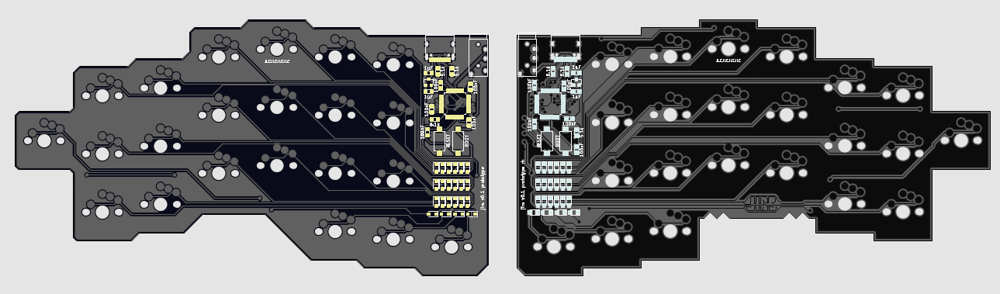

# Jirs Keyboard Prototype



This keyboard is a fork of a great keyboard
[KeySeeBee](https://github.com/TeXitoi/keyseebee) by TeXitoi. Includes
changes to the keys layout and the components placement.

This is a prototype, so everything is a subject to change.

The firmware is [Keyberon](https://github.com/TeXitoi/keyberon)

## Planned changes

* Diodes placement: They look good on the front side of the pcb, but
  they took a lot of space. I want to move them closer to the
  switches.
* Audio Jack 3.5 mm placement looks weird to me, I used to the
  crkbd/jorne style placement, closer to the thumb cluster.
* Plated Through Holes for several features: panel cover, top plate,
  bottom plate
* I want to make several version of the keyboard. One should be slim
  (pcb only, low profile switches), another one is more common, with
  the bottom plate, top plate, panel cover. Maybe some corne-ish
  tilting. Hot-swap version for low profile and regular sockets.

## Features

* 44 keys, using Cherry MX or Kailh choc switches, only 1U keycaps;
* USB-C connector on the 2 sides;
* TRRS cable for connecting the 2 halves (for power and UART communication between the 2 halves);
* 2 STM32F072 MCU, with hardware USB DFU bootloader and crystal less USB;
* Only onboard SMD component (except for the switches and TRRS connector).

## Inspiration

* jian, jiran, and jorne for the layout
* KeySeeBee for the stm32 based pcb design

## Gallery

TBA

## Bill Of Materials

TBA

## Compiling and flashing

Install the complete toolchain and utils:

```shell
curl https://sh.rustup.rs -sSf | sh
rustup target add thumbv6m-none-eabi
rustup component add llvm-tools-preview
cargo install cargo-binutils
sudo apt-get install dfu-util
```

Compile:

```shell
cd firmware
cargo objcopy --bin jirs --release -- -O binary jirs.bin
```

To flash using dfu-util, first put the board in dfu mode by pressing
BOOT, pressing and releasing RESET and releasing BOOT. Then:

```shell
dfu-util -d 0483:df11 -a 0 -s 0x08000000:leave -D jirs.bin
```

The fist time, if the write fail, your flash might be protected. To
unprotect:

```shell
dfu-util -d 0483:df11 -a 0 -s 0x08000000:force:unprotect -D jirs.bin
```

Ideally both sides needs to be flashed, but for changes that only affect the layout it's strictly not needed as the side connected with the USB cable will determine the layout. In fact, you can have different layouts stored on each half, meaning you can switch back and forth between two layouts by moving the USB cable between the two halves.

## What's the layout

TBD
